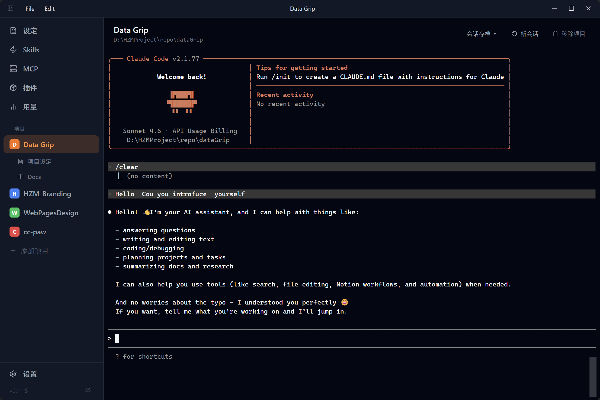
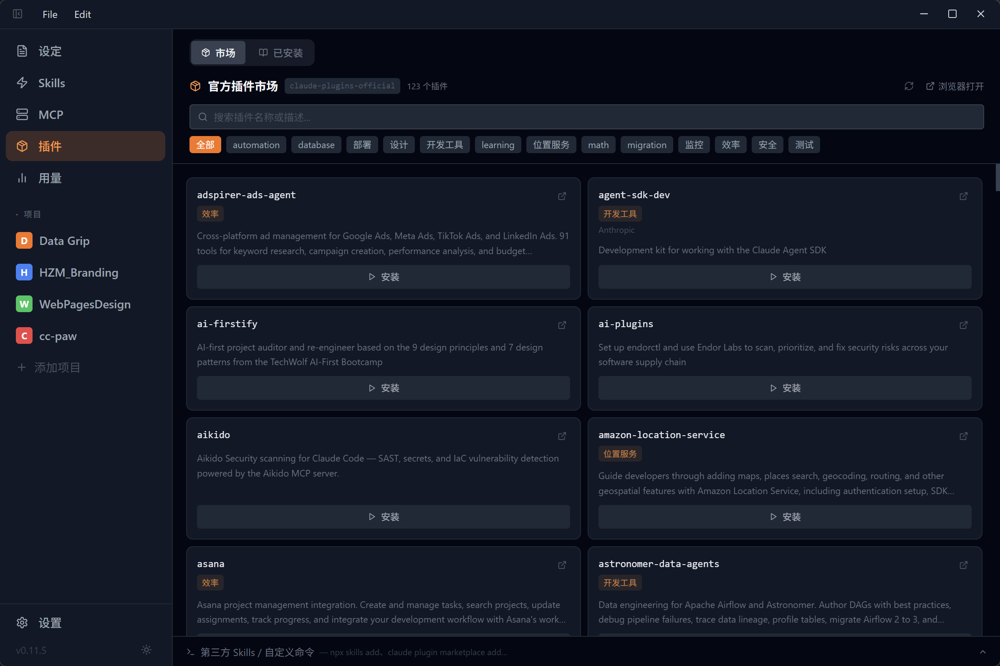
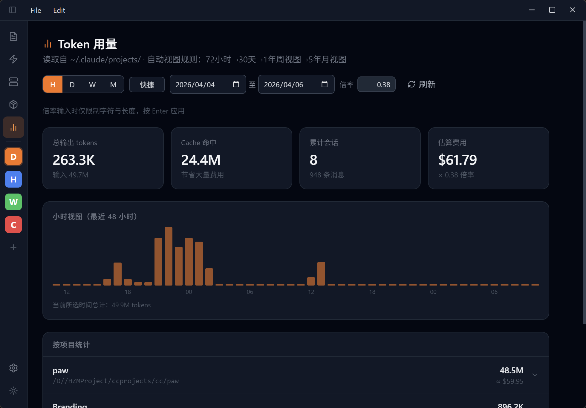

<div align="center">
  

  # CC Paw

  [English](README.md) | 中文

  **管理 [Claude Code](https://claude.ai/code) 与 Codex 工作流的桌面 GUI 应用。**

  [](package.json)
  [](LICENSE)
  [](#平台支持)
  [](https://electronjs.org/)
  [](https://react.dev/)
  [](https://www.typescriptlang.org/)
</div>

---

CC Paw 面向需要同时管理多个 Claude Code 与 Codex 项目的用户：把分散在终端和配置文件中的流程，整合为一个清晰的可视化工作区。每个项目都有独立且持久的会话、实时状态与通知，你可以把精力放在需求与决策上，而不是反复切换工具。

它还把 Claude Code 与 Codex 的关键配置流程可视化：系统指令（`CLAUDE.md`）、Skills、MCP 服务器、插件、项目文档与用量分析都能在界面统一管理。无论是非技术用户还是技术用户，都能更便捷地管理项目，获得更顺畅、更稳定的 vibecoding 体验。

## 获取应用

- **安装包（推荐）：** 在 [GitHub Releases](https://github.com/HyacinH/cc-paw/releases) 下载最新 **DMG**（macOS）或 **Setup .exe**（Windows）。
- **macOS 安装提示（Gatekeeper）：** 若出现“`CC Paw` 已损坏，无法打开”的提示，请先把应用拖到 `Applications`，再执行：

```bash
sudo xattr -rd com.apple.quarantine "/Applications/CC Paw.app"
```

- **源码运行：** 克隆仓库后执行 `npm install`，再 `npm run dev`（详见下文 [快速开始](#快速开始)）。完整使用需要已安装 **Claude Code** 和/或 **Codex** CLI，且存在可用的 `~/.claude/` 和/或 `~/.codex/`。
- **本地打包：** 执行 `npm run package`，在 `release/` 下生成当前系统对应的安装包（仅当前主机平台）。

## 核心功能

### 项目工作区（多项目、会话、文档、设定）

与项目直接相关的核心流程集中在同一个工作区（下图为对应界面）：

- **多项目并行会话：** 每个项目独立且持久的 CLI 终端（Claude Code 或 Codex），切换项目不丢上下文。
- **会话生命周期管理：** 支持新建会话，也可回看并继续历史存档会话。
- **项目管理：** 支持项目命名、侧边栏快速切换，以及按项目状态实时标记。
- **项目文档（Docs）：** 在 `docs/` 内编辑 Markdown，实时预览并自动保存。
- **项目设定：** 直接在界面编辑共享 CLI 配置（`~/.claude/settings.json`、`~/.codex/config.toml`）。



### 插件市场

插件相关能力集中在同一处，避免跨页面跳转（下图为对应界面）：

- 浏览/筛选官方插件市场
- 一键安装并查看实时终端输出
- 选择安装范围：**用户级**（`~/.claude`）或 **项目级**
- 管理已安装插件（启用/禁用/卸载）
- 直接运行 `claude plugin` 与 `npx skills` 命令



### Token 用量分析

用量与成本在独立面板统一展示（下图为对应界面）：

- 读取 `~/.claude/projects/` 下 Claude Code JSONL 日志，以及 `~/.codex/sessions/` 下 Codex 会话日志
- 汇总输入/输出/cache token 与估算费用
- 支持自定义时间范围筛选
- 提供按小时 / 日 / 周 / 月的柱状图视图
- 按项目拆分并支持展开明细



### 系统设定

在 Monaco Editor 中统一维护全局与项目级 `CLAUDE.md` 系统指令。

### Skills 管理

管理 `~/.claude/skills/`，支持新增、编辑与 URL 导入。

### MCP 服务器配置

可视化编辑 `~/.claude.json` 的 `mcpServers` 并在保存前校验。

---

## 平台支持

| 平台 | 状态 | 说明 |
|---|---|---|
| **macOS** | ✅ 完整支持 | 原生 `hiddenInset` 标题栏，login shell PATH 捕获 |
| **Windows** | ✅ 支持 | 系统原生标题栏，ConPTY 终端，NSIS 安装包 |
| Linux | 🔧 未测试 | 理论上可用；PTY 和文件路径均已跨平台处理 |

### 环境要求

**所有平台：**
- **Node.js** 18+
- **npm** 9+
- 已安装 **Claude Code** 和/或 **Codex** CLI（需存在 `~/.claude/` 和/或 `~/.codex/`）

**仅 Windows** — `node-pty` 是 C++ 原生模块，需要编译器工具链。在**管理员 PowerShell** 中运行：

```powershell
winget install Microsoft.VisualStudio.2022.BuildTools
winget install Python.Python.3.11
```

安装 Build Tools 后，打开 **Visual Studio Installer → 修改**：

- **工作负载**选项卡：勾选**使用 C++ 的桌面开发**
- **单个组件**选项卡：搜索 `Spectre`，勾选 **MSVC v143 - VS 2022 C++ x64/x86 Spectre 缓解库**

> Spectre 缓解库**默认不勾选**，但 `node-gyp` 编译时必须。缺少它会导致 `npm install` 报 Spectre 或 `node-gyp` 相关错误。

然后在 **CMD 或 PowerShell** 中运行（请勿使用 Git Bash——路径处理方式不同）：

```cmd
npm install
```

> **最低 Windows 版本：** Windows 10 版本 1903（Build 18362）或更高 — ConPTY 所需。

---

## 快速开始

```bash
# 克隆仓库
git clone <repo-url>
cd cc-paw

# 安装依赖（同时编译 node-pty 原生模块）
npm install

# 以开发模式启动（支持热重载）
npm run dev
```

应用打开后，点击侧边栏的 **+** 添加项目目录，再点击项目名称即可打开 CLI 会话。

## 构建与打包

```bash
npm run build      # 编译 TypeScript 并打包所有资源

npm run package    # 打包为平台原生安装包：
                   #   macOS   → release/CC Paw-x.x.x.dmg
                   #   Windows → release/CC Paw Setup x.x.x.exe
```

> `npm run package` 仅为当前主机平台构建，不支持交叉编译。

---

## 架构

CC Paw 是标准的 Electron 应用，严格分离进程职责。所有文件系统和 shell 操作在**主进程**中运行；**渲染进程**（React）是纯 UI 层，无法直接访问 Node.js API。

```
┌──────────────────────────────────────────────────────────────────────┐
│  渲染进程（React + TypeScript，运行在 Chromium 沙箱中）               │
│                                                                      │
│   Pages / Components  →  src/api/*  →  window.electronAPI.*         │
└────────────────────────────────┬─────────────────────────────────────┘
                                 │  contextBridge（仅白名单 API）
┌────────────────────────────────▼─────────────────────────────────────┐
│  Preload 脚本（electron/preload.ts）                                 │
│  contextIsolation=true · nodeIntegration=false                       │
└────────────────────────────────┬─────────────────────────────────────┘
                     ┌───────────┴────────────┐
              invoke（请求/响应）          on/send（推送事件）
                     │                         │
┌────────────────────▼─────────────────────────▼───────────────────────┐
│  主进程（Node.js，electron/ipc/*.handler.ts）                         │
│                                                                      │
│  ┌──────────────┐  ┌──────────────┐  ┌───────────────┐              │
│  │  (~/.claude, │  │   node-pty   │  │  shell 运行器 │              │
│  │   ~/.codex)  │  │  （终端会话）│  │ （插件/skills）│             │
│  └──────────────┘  └──────────────┘  └───────────────┘              │
└──────────────────────────────────────────────────────────────────────┘
```

所有 IPC channel 名称遵循 `domain:action` 规范（如 `skills:write`、`mcp:read`）。每个 handler 返回统一的结果结构——`{ success: true; data: T }` 或 `{ success: false; error: string }`——由 `src/api/` 层解包，页面直接获得 `data` 或抛出错误。平台差异逻辑（PATH 解析、shell 检测、二进制路径定位）统一收在 `electron/services/platform.ts`。

---

## 开源协议

[MIT](LICENSE)

